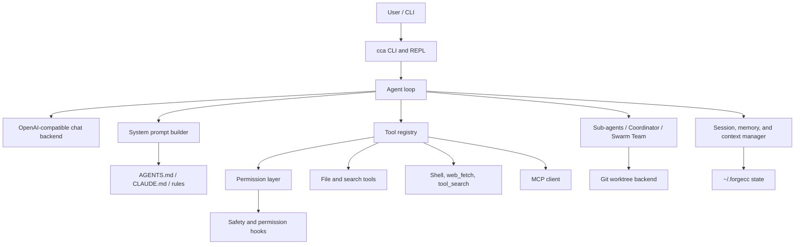

# ForgeCC

ForgeCC 是一个从零实现的 Python coding agent CLI，支持 OpenAI-compatible chat backend、工具调用、权限控制、上下文压缩、会话持久化、记忆、Skills、MCP 集成和多 Agent 编排。把 coding agent 的关键运行机制摊开：模型消息循环如何推进、工具如何被注册和调用、写文件和执行 shell 前如何确认权限、长上下文如何裁剪和压缩、会话和记忆如何持久化，以及多个 agent 如何围绕任务板和 worktree 协作。

## 项目亮点

- **Readable agent runtime**：主循环、流式输出、工具调用、错误恢复、预算限制和 session 状态都集中在一个易读的 Python 实现中。
- **OpenAI-compatible backend**：默认使用 `/chat/completions` 风格接口，模型、API base URL 和 prompt cache retention 都可通过环境变量或 CLI 参数配置。
- **Tool and permission system**：内置文件、搜索、shell、web fetch、todo、skill、sub-agent、MCP 等工具，并支持默认确认、只读计划、自动批准编辑、跳过确认和自动拒绝等权限模式。
- **Context and memory management**：支持大工具结果持久化、microcompact、自动 compact、项目记忆注入、token/cost 统计和会话恢复。
- **Multi-agent orchestration**：包含 fork-return sub-agent、Coordinator 编排模式、持久化 Swarm Team、mailbox 协议和独立 git worktree 写入后端。
- **Extensible runtime hooks**：兼容 Claude Code 风格 hook，可在用户输入、工具执行前后和权限请求时插入安全策略。
- **Evaluation scripts**：仓库包含 coding-agent latency/token、context/memory 和安全相关 benchmark 脚本，用于观察不同 agent runtime 设计的行为差异。

## 演示

下面是几条可复现的演示路径，覆盖普通问答、只读计划、自动批准编辑和多 Agent 编排。

```bash
cca "解释这个项目的 agent loop，并指出核心文件"
cca --plan "先分析如何给工具系统加一个新工具"
cca --accept-edits "修复一个小的 lint/test 问题"
cca --coordinator "让多个 agent 并行审查这个仓库"
```

## 架构



核心实现集中在 `src/mini_coding_agent/`。其中 `agent.py` 负责 agent loop 和模型交互，`tools.py` 负责工具 schema、权限检查和工具执行，`prompt.py` 负责系统提示词构造，`session.py` / `memory.py` 负责持久化状态，`tasks.py` / `teams.py` / `worktrees.py` 负责多 agent 协作。

## 快速开始

目标环境：

- macOS
- Shell：zsh
- Conda 环境：`cc`
- Python 3.11+

```bash
conda activate cc
pip install -e .
export OPENAI_API_KEY="your-key"
export OPENAI_BASE_URL="https://api.openai.com/v1"
export OPENAI_MODEL="gpt-4.1-mini"
cca "summarize this repository"
```

CLI 参数可以覆盖模型和 API 地址：

```bash
cca --model gpt-4.1-mini --api-base https://api.openai.com/v1 "hello"
```

使用官方 OpenAI API 时，ForgeCC 会发送稳定的 prompt cache key，并在 `/cost` 中显示 cached input tokens。ForgeCC 默认不主动设置 retention；如需请求 24h retention，可设置：

```bash
export CCA_PROMPT_CACHE_RETENTION="24h"
```

## 使用方式

一次性运行：

```bash
cca "解释这个项目的 agent loop"
```

进入交互式 REPL：

```bash
cca
```

常用选项：

```bash
cca --plan "先分析如何重构工具系统"
cca --accept-edits "修复测试失败"
cca --yolo "运行测试并修复问题"
cca --dont-ask "只做静态检查"
cca --coordinator "让多个 agent 并行审查这个仓库"
cca --resume
cca --max-cost 0.50 --max-turns 20 "实现一个小功能"
```

REPL 内置命令：

```text
/clear      清空会话历史
/plan       切换只读计划模式
/cost       查看 token 和估算成本
/compact    手动压缩上下文
/todos      查看当前会话 todo_write 清单
/tasks      查看后台 sub-agent 任务
/teams      查看持久化 agent team
/memory     列出记忆
/skills     列出 skills
exit        退出
```

会话保存在 `~/.forgecc/sessions`，工具大结果和记忆也保存在 `~/.forgecc` 下。项目级 team/worktree 状态保存在当前仓库的 `.forgecc/teams` 和 `.forgecc/worktrees` 下，便于 agent team 与 git worktree 后端围绕当前项目工作。

## 核心能力

### Agent Runtime

- CLI 一次性 prompt 和交互式 REPL
- OpenAI-compatible `/chat/completions` 后端
- Streaming assistant output 和 tool-call delta 处理
- 消息历史、JSON session 持久化和 `--resume`
- token/cost 统计、最大花费和最大轮次限制

### 工具与权限

- 文件工具：`list_files`、`read_file`、`write_file`、`edit_file`、`grep_search`
- Runtime 工具：`run_shell`、`web_fetch`、`tool_search`
- Agent 工具：`todo_write`、skill 调用、sub-agent、plan mode、team/worktree 工具
- 权限模式：默认确认、只读计划、自动批准编辑、跳过确认、自动拒绝
- 可选 shell sandboxing，与工具权限检查分层处理

### 上下文与持久化

- 大输出裁剪和持久化，避免工具结果直接撑爆 history
- microcompact 和自动 compact
- 项目级记忆读取与注入
- Skills 从 `.claude/skills/<name>/SKILL.md` 发现可复用指令

## 多 Agent

ForgeCC 当前包含三层 multi-agent 能力：

- **Sub-Agent fork-return**：`agent` 工具启动独立上下文完成搜索、分析、计划或一般任务，结果返回主会话。
- **Coordinator**：主 Agent 进入编排模式后，只保留 orchestration 工具，负责拆分任务、启动后台 sub-agent、查看 `task_status` / `task_output` 并汇总结果。
- **Swarm Team**：`team_create` 创建持久化 team，成员通过共享 task board 和 mailbox 协作，可自主 `team_claim_task`、`team_update_task`、`team_send_message`、`team_idle`。

Team mailbox 使用固定消息协议：

```text
REQUEST  请求某个 agent 或全体执行/协助一项工作
REPLY    回复某条消息，必须带 thread_id
STATUS   报告进度或完成情况
BLOCKED  报告阻塞和原因
```

写入型 team member 可设置 `worktree=true`，ForgeCC 会为其创建独立 git worktree。常用 review / integration 工具：

```text
worktree_status
worktree_diff
worktree_commit
worktree_merge
worktree_cleanup
```

`worktree_commit`、`worktree_merge`、`worktree_cleanup` 在普通权限模式下会触发确认；Plan Mode 下只允许查看 status/diff。

## MCP Runtime

MCP 配置从 `.claude/settings.json`、`~/.claude/settings.json` 或 `.mcp.json` 读取。除了把 MCP server tools 暴露为 `mcp__server__tool`，ForgeCC 还支持：

```text
mcp_list_resources
mcp_read_resource
mcp_subscribe_resource
mcp_unsubscribe_resource
mcp_poll
mcp_oauth_status
```

其中 `mcp_oauth_status` 只检查配置和 token/env 状态；CLI 当前不执行浏览器式 OAuth 授权流。

## 安全 Hooks

ForgeCC 支持 Claude Code 风格的 hook 配置，重点接入安全和权限相关事件：

- `UserPromptSubmit`：用户输入进入模型前触发，可记录 prompt、阻断敏感信息、追加短上下文。
- `PreToolUse`：工具执行前触发，可阻断危险 shell、`.env` 访问、越界写入。
- `PermissionRequest`：需要权限确认时触发，可自动 allow/deny 或继续交给用户确认。
- `PostToolUse`：工具成功后触发，可做写入后的 secret scan、代码安全检查、审计记录。
- `PostToolUseFailure`：工具失败、被拒或被 hook 阻断后触发，可记录结构化安全事件。

仓库自带的 `.claude/settings.json` 已启用默认安全策略，脚本在 `.claude/hooks/`：

- `pre_tool_use.py`：阻断危险 shell、敏感文件访问、越界写入。
- `permission_request.py`：对需要确认的操作做二次安全判断。
- `post_tool_use.py`：检查写入内容和工具输出中的 secret-like 内容。
- `post_tool_use_failure.py`：记录失败、拒绝、阻断事件。
- `user_prompt_submit.py`：阻断用户 prompt 中疑似直接粘贴的 secret。

也可以按项目需要调整 `.claude/settings.json`：

```json
{
  "hooks": {
    "PreToolUse": [
      {
        "matcher": "run_shell",
        "hooks": [
          {"type": "command", "command": "python .claude/hooks/pre_tool_use.py"}
        ]
      }
    ],
    "PermissionRequest": [
      {
        "matcher": "",
        "hooks": [
          {"type": "command", "command": "python .claude/hooks/permission_request.py"}
        ]
      }
    ]
  }
}
```

Hook 命令会从 stdin 收到 JSON payload。返回 exit code `2` 会阻断当前事件；也可以向 stdout 输出 JSON，例如：

```json
{
  "hookSpecificOutput": {
    "hookEventName": "PermissionRequest",
    "decision": {
      "behavior": "deny",
      "message": "Reading .env is not allowed"
    }
  }
}
```

## Benchmark 与实验

仓库包含几组轻量 benchmark，用来观察 agent runtime 的延迟、token 使用、上下文管理和安全策略行为。它们不是完整 SWE-bench 解题评测，而是面向 runtime 设计的实验脚手架。

- [`benchmarks/coding_agent`](benchmarks/coding_agent)：基于 12 个轻量 SWE-bench Verified case，比较 streaming、并发安全工具、deferred tool schema 和 prompt cache 等变体的 latency/token 表现。
- [`benchmarks/context_memory`](benchmarks/context_memory)：基于较长任务观察上下文增长、compact、large-result persistence、gold file recall 和最终总结质量。
- [`benchmarks/security`](benchmarks/security)：用于生成和组织安全相关测试 case，辅助验证 hooks、权限和敏感信息防护。

示例运行：

```bash
python benchmarks/coding_agent/run_benchmark.py \
  --repos-root /tmp/swe-repos \
  --variant base \
  --variant deferred_cache

python benchmarks/context_memory/run_context_benchmark.py \
  --repos-root /tmp/swe-repos \
  --variant compression \
  --case-id ctx_swe_verified_front8_001
```

结果会写入对应的 `benchmarks/*/results/` 目录，便于用脚本继续聚合分析。

## 项目结构

```text
src/mini_coding_agent/
  __main__.py      CLI 参数解析和 REPL
  cli.py           cca 命令入口 wrapper
  agent.py         Agent loop、OpenAI 后端、流式输出、压缩、预算、Plan Mode
  tools.py         工具定义、执行和权限检查
  prompt.py        System Prompt 构造，加载 AGENTS.md / CLAUDE.md / rules
  session.py       会话持久化
  memory.py        项目记忆
  skills.py        skills 发现和解析
  subagent.py      子 Agent 配置
  tasks.py         后台 sub-agent task runtime
  teams.py         Swarm team、task board、mailbox、idle/wake runtime
  worktrees.py     Git worktree 隔离写入 backend
  mcp_client.py    MCP JSON-RPC over stdio 客户端
  hooks.py         安全/权限 hook 加载和执行
  ui.py            终端输出
```

说明性教程文档保存在 [`docs/`](docs/)。这些文档来自参考项目，用于学习 agent 架构；根项目的可运行实现以 `src/mini_coding_agent/` 为准。

## 与参考项目关系

ForgeCC 参考了 `claude-code-from-scratch` 的教学思路，但当前仓库只保留 Python 版本实现，并使用本项目自己的包名、CLI 入口和 OpenAI-compatible 默认配置。

在此基础上，ForgeCC 继续加入或整理了多项 runtime 能力：OpenAI-compatible 配置、prompt cache 统计、Claude-style hooks、MCP runtime、Coordinator/Swarm team、多 agent mailbox、git worktree backend，以及面向 coding agent runtime 的 benchmark 脚本。

## 验证

```bash
conda run -n cc python -m compileall src
conda run -n cc cca --help
```

如果修改了 LLM 交互、工具调用或权限逻辑，建议再用真实或假的 OpenAI-compatible endpoint 做一次端到端测试。
